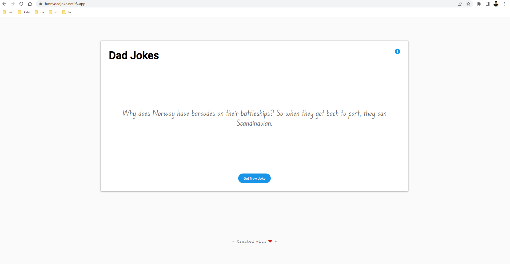
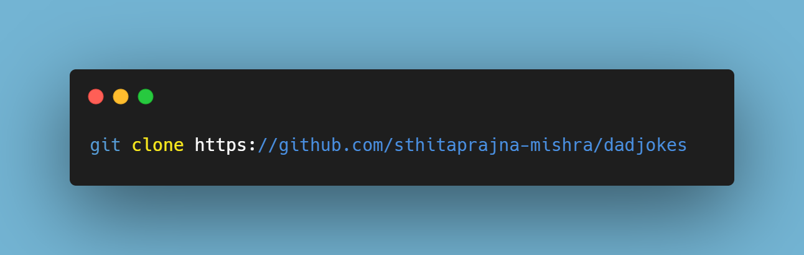

# DadJokes: Dealing with API in JS

<a href="https://funnydadjoke.netlify.app">View Demo</a>

## About the project

This project deals with fetching json data from a free [API](https://icanhazdadjoke.com/) available online. 

### **Demo**
 

## Built With

+ HTML
+ CSS
+ JavaScript

## Tools

+ [git](https://git-scm.com/downloads)
+ [Visual Studio Code](https://code.visualstudio.com/)
+ [Live Server](https://marketplace.visualstudio.com/items?itemName=ritwickdey.LiveServer)

## Setup and Installation

+ In order to set up all the code on your local machine, you can either download a ZIP of all the files directly or you can clone the code to your local machine, provided you installed git.

+ Run the following git command on your command line terminal to clone the files to your machine - 

+ Once the files are on your machine, open the medium-clone folder in Visual Studio Code.

+ With the files open in Visual Studio Code, press the Go Live button at the bottom of the window to launch the files with Live Server.
